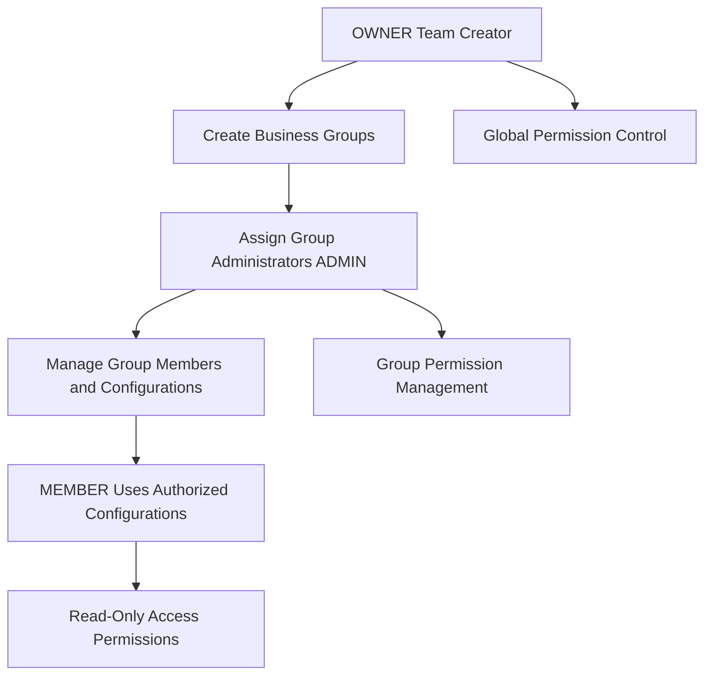

# Product Roadmap

Nexion is rapidly evolving! We're committed to building the most powerful Web3 SSH management platform. Here are the features we're developing and planning. **Join now to enjoy early user pricing advantages**.

## 🚀 Development Vision

Our goal is to evolve Nexion from a simple SSH management tool into an **enterprise-grade decentralized server management platform**, providing secure, efficient, and economical solutions for individual developers and enterprise teams.

## 👥 Enterprise-Level Team Collaboration

### Team Account Upgrade

Upcoming team version features to make Nexion a true enterprise-grade tool:

```yaml
Team Version Core Features:
  Account Upgrade: One-click upgrade from personal user to team manager
  Permission System: Three-tier permission management (OWNER/ADMIN/MEMBER)
  Cost Advantage: Save 95% compared to traditional enterprise tools
  Blockchain Storage: Configuration and permission records are immutable
```

### Group Management System

Flexible server configuration grouping to meet different business scenarios:

**Project-Dimension Grouping**
- Frontend server group: web-server, cdn-server, static-server
- Backend server group: api-server, db-server, cache-server
- Infrastructure group: monitoring, logging, backup-server

**Environment-Dimension Grouping**
- Development environment: Full access permissions, rapid iteration
- Testing environment: QA team primary workspace
- Production environment: Restricted access, only senior staff can operate

**Department-Dimension Grouping**
- Development team: Daily development server access
- Operations team: Infrastructure and monitoring servers
- Security team: Audit and compliance related servers

### Permission Delegation Mechanism



### Audit & Compliance

```yaml
Enterprise Audit Features:
  Operation Logs: All member server access and operation records
  Permission Tracking: Complete history of permission changes
  Compliance Reports: Auto-generated audit reports meeting enterprise security standards
  Blockchain Storage: Blockchain technology ensures logs are immutable
```

### Use Cases

**Mid-size Internet Company Example:**
```
DevOps-Team (50-person team)
├── Frontend Group (15 people)
│   └── Admin: Frontend Leader, Members: Frontend developers
├── Backend Group (20 people)
│   └── Admin: Backend Leader, Members: Backend developers
├── Operations Group (10 people)
│   └── Admin: Operations Leader, Members: SRE engineers
└── Data Group (5 people)
    └── Admin: Data Leader, Members: Data engineers
```

## ✨ User Experience Upgrade

### UI & UX Enhancement

We're comprehensively upgrading the user interface and interaction experience:

```yaml
Interface Optimization Plan:
  Modern Design: Interface style more aligned with developer aesthetics
  Interaction Fluidity: Optimize operation flow and response speed
  Personalized Customization: Support theme and layout personalization
  Usability Improvement: Simplify complex operations, improve work efficiency
```

### AI Terminal Copilot

Integrate AI assistant to make terminal operations smarter:

```yaml
AI Assistant Features:
  Intelligent Command Suggestions: Recommend most suitable commands based on context
  Error Diagnostic Assistant: Automatically analyze errors and provide solutions
  Operation Optimization Suggestions: Intelligently recommend more efficient operation methods
  Learn User Habits: Personalized command and script recommendations
```

**AI Copilot Application Scenarios:**
- Auto-complete and suggest commands when typing partial commands
- Provide intelligent diagnosis and repair suggestions when encountering errors
- Recommend common operations based on server environment
- Learn user habits and provide personalized workflow optimization

## 💰 Pricing Strategy

### Early User Advantages

**Nexion is currently in rapid development, and we provide advantageous pricing for early users.**

As product features continue to improve and user experience continues to enhance, our pricing will be adjusted accordingly:

- **Feature Enhancement** → More Value → Pricing Optimization
- **User Growth** → Network Effect → Cost Sharing
- **Early Support** → Price Protection → Long-term Benefits

**Early users will enjoy:**
- 🎯 Long-term protection of current advantageous pricing
- 🚀 Priority access to new features
- 💎 Early supporter status in the community
- 🎁 Exclusive community benefits from time to time

## 🎯 Why Join Now?

### 1. Optimal Pricing Window
- Current pricing is 20%-30% of future pricing
- Pricing will be gradually adjusted after feature completion
- Early users enjoy permanent price protection

### 2. Witness Product Growth
- Participate in key stages of product development
- Directly influence feature priorities and design direction
- Direct communication and feedback with development team

### 3. Technical Leadership Advantage
- Be first to experience the innovative combination of Web3 + SSH
- Master next-generation server management technology
- Establish technical leadership position in the industry

### 4. Community Pioneer Status
- Become an early evangelist for Nexion
- Gain community recognition and exclusive privileges
- Enjoy priority technical support services

---

> 💡 **Take Action Now**: Download Nexion now to lock in future features at the best price!