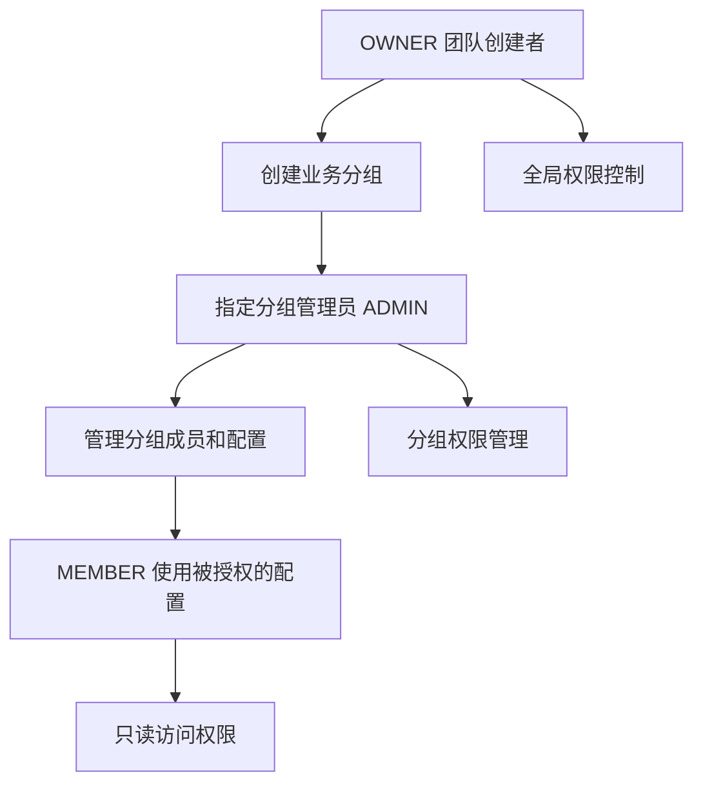

# 产品路线图

Nexion 正在快速发展中！我们致力于打造最强大的 Web3 SSH 管理平台。以下是我们正在开发和计划中的功能，**现在加入可以享受早期用户的优惠定价**。

## 🚀 发展愿景

我们的目标是将 Nexion 从一个简单的 SSH 管理工具，发展成为**企业级的去中心化服务器管理平台**，为个人开发者和企业团队提供安全、高效、经济的解决方案。

## 👥 企业级团队协作

### 团队账户升级

即将推出的团队版功能，让 Nexion 成为真正的企业级工具：

```yaml
团队版核心功能:
  账户升级: 个人用户一键升级为团队管理者
  权限体系: OWNER/ADMIN/MEMBER 三级权限管理
  成本优势: 相比传统企业工具节省 95% 费用
  区块链存储: 配置和权限记录不可篡改
```

### 分组管理系统

灵活的服务器配置分组，满足不同业务场景：

**项目维度分组**
- 前端服务器组：web-server、cdn-server、static-server
- 后端服务器组：api-server、db-server、cache-server
- 基础设施组：monitoring、logging、backup-server

**环境维度分组**  
- 开发环境：完全访问权限，快速迭代
- 测试环境：QA 团队主要工作区域
- 生产环境：受限访问，只有高级人员可操作

**部门维度分组**
- 开发团队：日常开发服务器访问
- 运维团队：基础设施和监控服务器
- 安全团队：审计和合规相关服务器

### 权限下放机制



### 审计与合规

```yaml
企业级审计功能:
  操作日志: 所有成员的服务器访问和操作记录
  权限追踪: 权限变更的完整历史记录
  合规报告: 自动生成符合企业安全标准的审计报告
  区块链存储: 利用区块链技术确保日志不可篡改
```

### 使用场景

**中型互联网公司示例：**
```
DevOps-Team (50人团队)
├── 前端分组 (15人) 
│   └── 管理员：前端Leader，成员：前端开发者
├── 后端分组 (20人)
│   └── 管理员：后端Leader，成员：后端开发者  
├── 运维分组 (10人)
│   └── 管理员：运维Leader，成员：SRE工程师
└── 数据分组 (5人)
    └── 管理员：数据Leader，成员：数据工程师
```

## ✨ 用户体验升级

### UI & UX 强化

我们正在全面升级用户界面和交互体验：

```yaml
界面优化计划:
  现代化设计: 更符合开发者审美的界面风格
  交互流畅性: 优化操作流程和响应速度
  个性化定制: 支持主题和布局个性化配置
  易用性提升: 简化复杂操作，提高工作效率
```

### AI Terminal Copilot

集成人工智能助手，让终端操作更智能：

```yaml
AI 助手功能:
  智能命令建议: 基于上下文推荐最合适的命令
  错误诊断助手: 自动分析错误并提供解决方案  
  操作优化建议: 智能推荐更高效的操作方式
  学习用户习惯: 个性化的命令和脚本推荐
```

**AI Copilot 应用场景：**
- 输入部分命令时自动补全和建议
- 遇到错误时提供智能诊断和修复建议
- 根据服务器环境推荐常用操作
- 学习用户习惯，提供个性化的工作流优化

## 💰 定价策略

### 早期用户优惠

**Nexion 目前处于快速发展期，我们为早期用户提供了优惠的定价策略。**

随着产品功能的不断完善和用户体验的持续提升，我们的定价将会进行相应调整：

- **功能完善** → 更多价值 → 定价优化
- **用户增长** → 网络效应 → 成本分摊
- **早期支持** → 价格保护 → 长期受益

**早期用户将享受：**
- 🎯 当前优惠定价的长期保护
- 🚀 新功能的优先体验权限
- 💎 社区中的早期支持者身份
- 🎁 不定期的专属社区福利

## 🎯 为什么选择现在加入？

### 1. 最优价格窗口
- 当前价格为未来的 20%-30%
- 功能完善后价格将逐步调整
- 早期用户享受永久价格保护

### 2. 见证产品成长  
- 参与产品发展的关键阶段
- 直接影响功能优先级和设计方向
- 与开发团队直接沟通反馈

### 3. 技术领先优势
- 率先体验 Web3 + SSH 的创新结合
- 掌握下一代服务器管理技术
- 在行业中建立技术领先地位

### 4. 社区先锋身份
- 成为 Nexion 早期布道者
- 获得社区认可和专属权益
- 享受优先技术支持服务

---

> 💡 **立即行动**：现在就下载 Nexion，以最优惠的价格锁定未来功能！
